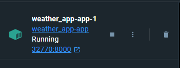

## Веб-приложение, для получения прогноза погоды в интересующем городе

Данный проект позволяет просматривать погоду в любом городе

## Содержание

- [Технологии](#технологии)
- [Начало работы](#начало-работы)
- [Команда проекта](#команда-проекта)

## Технологии

- Python 3.11
- Django
- DRF
- openmeteo_requests
- Geopy

## Начало работы

Весь проект представлен в docker образе для его запуска необходимо скачать Docker Desktop если у вас его нет. Сделать
это
можно на оффициальном сайте https://www.docker.com/

После установки необходимо собрать docker образ командой

```commandline
docker-compose build
```

После успешной установки образ необходимо запустить командой

```commandline
docker-compose up
```

Выполнив эту команду сайт будет доступен по адресу указанному в Docker Desktop



Основная страница веб-приложение находится по адресу /weather/
На данной странице можно написать необходимый город, а так же представленна история поиска, если она есть.
После ввода нужного города, нажав на кнопку вы получите краткую информацию о погоде во введенном городе.

Так же по адресу /weather/api/search_history/ доступна информация о всех городах, которые вы искали и какое количество
раз

# Команда проекта
Проект был выполнен:
- Иван Хрипунов - backend-разработчик 